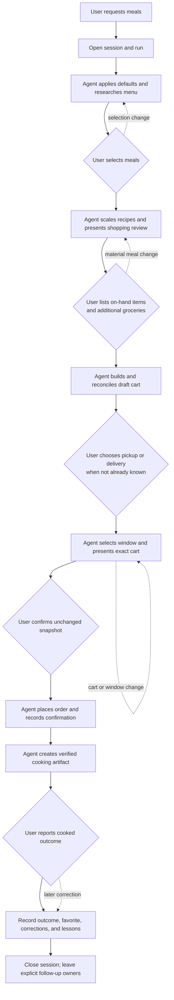

# Personal Chef

Personal Chef is a repository-backed workflow for an AI meal-planning and grocery-shopping agent. It turns preferences into a recipe menu, scales selected meals to six servings, builds comparable Food Lion and Instacart carts, pauses for approval, and records what happened so future runs improve.

## One-session process

The normal path has one explicit owner and next action at every checkpoint. The agent proceeds automatically through reversible work and pauses only for the user events shown as decision nodes.

### Example interaction

| Checkpoint | Typical user response | Deterministic interpretation |
| --- | --- | --- |
| Menu | “I like the cauliflower option” | Confirm that meal as the canonical selection; build its shopping review. |
| Shopping review | “I have butter and cheddar; add bananas” | Record pantry exclusions and additional groceries separately; begin cart construction without another confirmation. |
| Fulfillment | “Pickup” | Select pickup, inspect available windows, and report the exact choice. |
| Cart revision | “Set pickup for 3–4 and add blueberries” | Mutate the draft cart/window, invalidate any earlier approval, and present a new exact snapshot. |
| Approval | “Confirm” | Place only the single unchanged snapshot currently awaiting approval. |
| Artifact | “Print the recipe” | Generate and verify only the selected, reconciled recipe card, then print with Fit to page. |
| Outcome | “It was great; save it” | Record cooked feedback and promote the final cooked form to `recipes/`. Later corrections supersede the rating or repeat version without erasing history. |

The authoritative transition rules and standardized response contracts live in [`docs/WORKFLOW.md`](docs/WORKFLOW.md). The current audit is recorded in [`docs/AUDIT-2026-09-23.md`](docs/AUDIT-2026-09-23.md).

## Start here

1. Read [`AGENTS.md`](AGENTS.md) for the short operating contract and document map.
2. Read [`docs/DESIGN.md`](docs/DESIGN.md) for the product intent and authority model.
3. Update [`registers/preferences.yaml`](registers/preferences.yaml) when durable tastes or constraints change.
4. Copy [`local/private.example.yaml`](local/private.example.yaml) to `local/private.yaml` for private delivery details. The real file is ignored by Git.
5. Start each practical new-chat request from [`templates/session.yaml`](templates/session.yaml), then create and link a run from [`templates/run.yaml`](templates/run.yaml) when the request enters a menu/cart/order cycle.
6. Validate changes with `python scripts/validate.py` and the relevant checks in [`docs/QUALITY.md`](docs/QUALITY.md).

## Repository map

| Path | Purpose |
| --- | --- |
| `AGENTS.md` | Short agent entry point and map to the sources of truth |
| `docs/DESIGN.md` | Product intent, authority boundaries, system model, and design decisions |
| `docs/WORKFLOW.md` | Detailed meal-to-order operating sequence |
| `docs/QUALITY.md` | Acceptance criteria and verification layers |
| `docs/REGISTER_REFERENCE.md` | Data ownership, evidence, and freshness rules |
| `docs/OPERATIONS.md` | Repository maintenance procedures |
| `docs/AUDIT-2026-09-23.md` | Determinism audit, implemented changes, and deferred work |
| `registers/` | Durable preferences, retailer facts, availability, substitutions, outcomes, issues, and change history |
| `recipes/` | Versioned recipe records with scaling and nutrition metadata |
| `runs/` | One auditable record per menu/cart/order cycle |
| `sessions/` | One concise encounter record per practical chat request, linking work, lessons, and follow-up |
| `templates/` | Copyable YAML records for new sessions, recipes, menus, and runs |
| `artifacts/recipe-cards/` | Structured, revisioned recipe-card sources consumed by the generic PDF renderer |
| `local/` | Private machine-local configuration; real values are not committed |
| `scripts/build_recipe_cards.py` | Generic YAML-to-PDF renderer with no embedded recipe content |
| `scripts/validate.py` | Structural, cross-reference, card-source, and PDF-source-hash validation |

## Current baseline

- Six servings per selected meal.
- Most recipes under 45 minutes.
- High protein and vegetable-forward.
- Carb-heavy bases only occasionally.
- Prefer low-prep ingredients, Nature's Promise, and Food Lion brands.
- Prefer grass-fed beef.
- Compare pickup and delivery totals before checkout.

The first validated recipe is [`recipes/instant-pot-lemon-chicken-white-bean-kale-stew.yaml`](recipes/instant-pot-lemon-chicken-white-bean-kale-stew.yaml). The recipe library contains only meals that were cooked and positively evaluated by the user.
